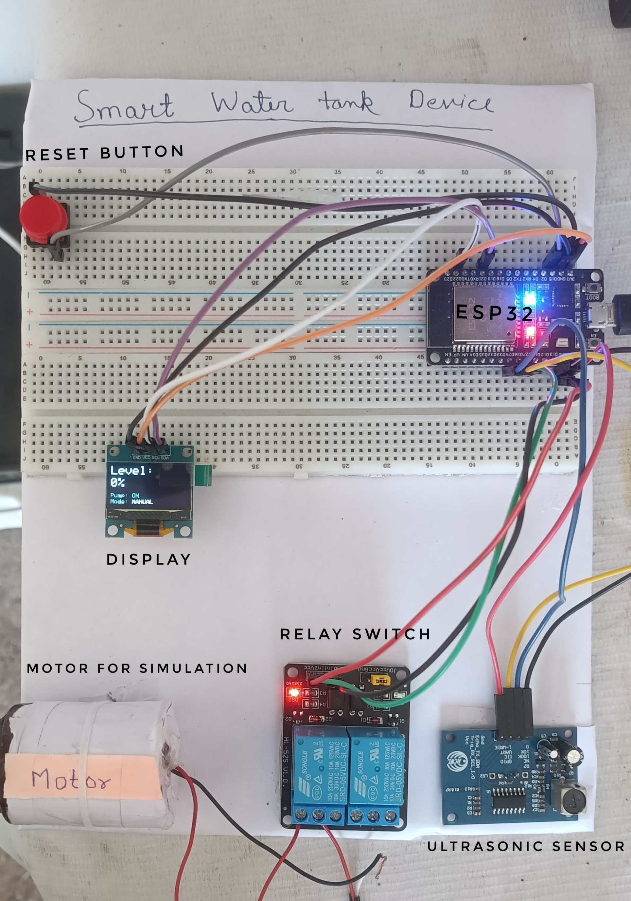

# ⚡ BIPIN_KUMAR | System Portfolio 

> **⚠️ STRICTLY PROPRIETARY & RESTRICTED REPOSITORY** > *This repository is provided for **viewing and portfolio demonstration purposes only**. The codebase, UI designs, and system architectures are proprietary. No part of this code may be copied, cloned, reproduced, distributed, modified, or used for any personal or commercial projects. All rights reserved.*

Welcome to the central telemetry feed and digital portfolio of **Bipin Kumar**. 

I am a **6th-Semester Electrical Engineering Student at BIT Sindri** and the **Founder of VyaparLens**. My core focus lies in bridging physical hardware with scalable software, leveraging AI-assisted development to rapidly architect, write, and deploy production-ready applications. 

---

## 🔌 The Grid [Tech Stack & Telemetry]

Built with an "AI-Assisted Dev" approach, this portfolio reflects my dual expertise in electrical hardware systems and modern full-stack architecture.

* **Core Framework:** Next.js 15 (App Router) & React 19
* **Styling & UI:** Tailwind CSS, Radix UI, Framer Motion
* **Hardware / IoT Stack:** ESP32, C++, Python, DHT11 Sensors, Ultrasonic Sensors
* **Software Stack:** TypeScript, Node.js, Flask, Flutter, Firebase, Recharts
* **Engineering Tools:** AutoCAD Electrical, Verilog HDL, ModelSim, Power BI

---

## 🔋 High Voltage Projects [System Log]

Here is a look at the subsystems and applications I have engineered, spanning from physical IoT automation to business SaaS platforms.

### 1. Automated Quality Control Rig for DC Motors
Engineered an automated ESP32-based rig that uses a DHT11 sensor and predictive linear regression models to identify overheating motors in real-time. It safely cuts power via a relay when anomalies are detected.
* **Tech:** C++, Python, scikit-learn, ESP32, L298D Motor Driver, 5V Relay

### 2. Smart Water Tank IoT System
A complete, production-ready system to automatically monitor and control industrial/home water tanks. Features live water level percentage, dual-mode control (Auto/Manual), and secure 3-level authentication.
* **Tech:** Flutter, Dart, Firebase Realtime DB, Cloud Functions, ESP32
* 📸 **Project Image:** 
* 🎥 **Live Demo:** [Watch on YouTube](https://www.youtube.com/embed/u7SZ2H8gCTA?si=Z3mcMeoHErbE1lcT)

### 3. VyaparLens (AI-Assisted Startup)
Architecting an AI-powered marketing application for small business owners, prioritizing strict user data privacy via on-device AI. Leading end-to-end product lifecycle, software architecture, and UI/UX design.

### 4. Upcycled IoT Sensor Hub
Innovatively repurposed an abandoned Android smartphone into a live environmental sensor hub. It reads onboard sensors using Termux and streams real-time telemetry to a web dashboard running in a virtual Ubuntu environment on the same device.
* **Tech:** Python, Flask, Termux, Ubuntu (proot), Plotly.js, Bash

> **Explore more in the UI:** *VLSI Digital Logic Design, Explore Jharkhand Platform, Power Plant Maintenance Dashboard, and Residential Solar Power System Design.*

---

## 📋 Field Experience & Education

**EXPERIENCE [SYS_OK]**
* **Founder & AI-Assisted Developer** | *VyaparLens* (Jan 2026 - Present)
* **Student Ambassador** | *Let's Upgrade* (July 2025 - Aug 2025)

**EDUCATION [BATTERY_CELLS]**
* **B.Tech // Electrical** | *BIT Sindri* (2023 - 2027) - *Discharging: 75%*
* **Senior Secondary (PCM)** | *BNS DAV Public School, Giridih* (2020 - 2022) - *Capacity: 100%*
* **Secondary** | *BNS DAV Public School, Giridih* (2018 - 2020) - *Capacity: 100%*

---

## 📡 Establish a Connection

If you are interested in discussing full-stack architecture, IoT automation, AI-assisted development, or electrical engineering, open a communication channel:

* **LinkedIn:** [https://www.linkedin.com/in/bipinkrvr/](https://www.linkedin.com/in/bipinkrvr/)
* **GitHub:** [@Bipinkrvr](https://github.com/Bipinkrvr)
* **Email:** [bipinkumarvr@gmail.com](mailto:bipinkumarvr@gmail.com)

---

## ⚖️ License & Copyright

**© 2026 Bipin Kumar. All Rights Reserved.**

This repository is **strictly proprietary**. It is provided publicly *solely* for portfolio demonstration and technical evaluation purposes. 

**You are strictly prohibited from:**
- Cloning, copying, downloading, or distributing this codebase.
- Forking this repository.
- Reusing the UI designs, custom components (e.g., the breadboard layouts, terminal UI, custom SCADA themes), or system architecture for any personal or commercial projects.

This is not an open-source project. All intellectual property rights belong to the creator.

   
  <i>[MOUNTING_RAIL: DIN_EN_50022] // Engineered with ⚡ by Bipin Kumar</i>

